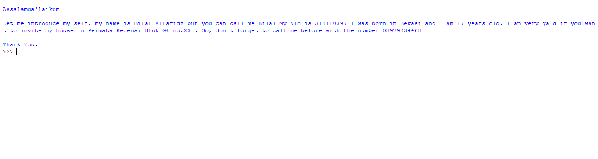

# Latihan 2
## Input Data Menggunakan Python

 

<a href="https://github.com/kyuurazz/Input_Data#Requirements">Requirements</a> •
<a href="https://github.com/kyuurazz/Input_Data#Tutorial">Tutorial</a>

## Requirements
- [Python](https://www.python.org/downloads/)

## Tutorial

- Pertama, Buka IDLE Python atau Text Editor di PC/Laptop kalian

- Klik (File > New File) untuk membuat File Baru

- Isi file tersebut dengan Program kalian, Disini saya membuat Program Penginputan Data

- Setelah itu Save Program kalian dengan klik (File > Save) atau tekan (CTRL + S)

- Berikan nama file tersebut dengan ekstensi .py

- Klik (Run > Run Module) untuk menjalankan Programnya 

### INPUT
- Masukan data kalian

### OUTPUT
- Hasil

- Selesai

## TERIMAKASIH